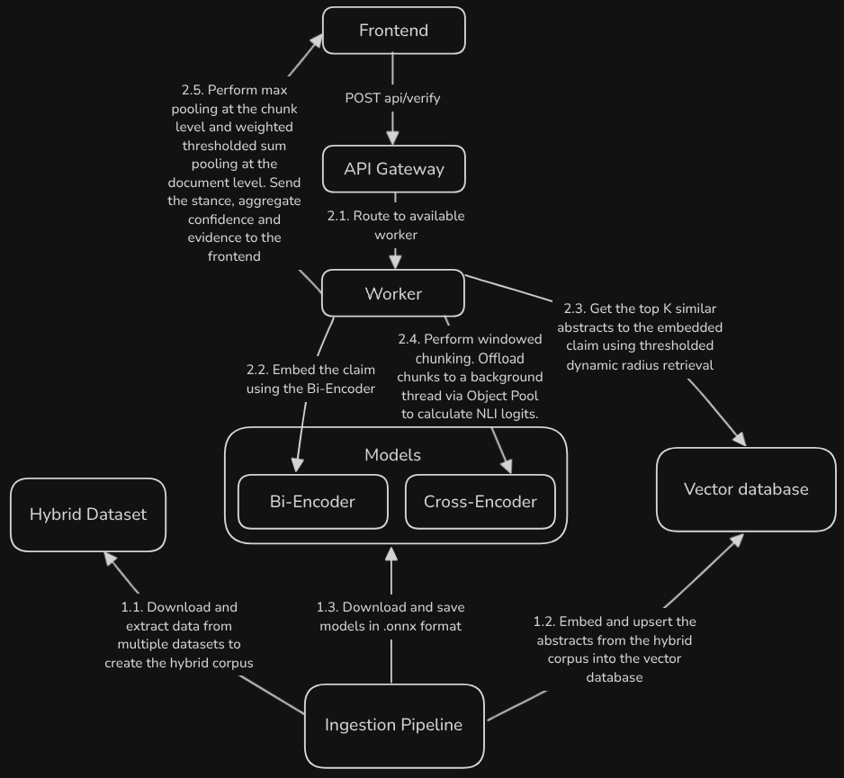

# Verity 

A high-performance scientific fact-checking engine that verifies claims against peer-reviewed literature using a Retrieval Augmented Natural Language Inference (NLI) pipeline.

## Overview

Verity is a full-stack application that combines dense vector retrieval with cross-encoder re-ranking to verify scientific and medical claims. It processes claims through a Rust-powered backend API, retrieves relevant documents from a Qdrant vector database, and analyzes evidence stance using ONNX-optimized transformer models.

### Key Features:
Verity was built to prioritize concurrency, hallucination resistance, and hardware efficiency without relying on expensive cloud GPUs or black-box LLMs.

* **Lock-Free Concurrency via Object Pooling:** Utilizes the `deadpool` crate to manage thread-local instances of ONNX models, achieving lock-free parallel execution across CPU cores.
* **Tokio Thread Offloading:** Synchronous, CPU-heavy matrix math (`Session::run()`) is seamlessly offloaded to background blocking threads using `web::block`. This ensures the Actix-Web event loop remains unblocked and responsive to incoming network traffic.
* **Deterministic NLI Chunking:** Prevents "Attention Dilution" by sanitizing and isolating document abstracts into sliding 2-sentence windows before passing them to the Cross-Encoder.
* **Advanced Stance Aggregation:** Calculates document stances via Chunk-Level Max Pooling, and determines the final system verdict using Weighted Thresholded Sum Pooling.
* **Dynamic Radius Retrieval:** Prevents the "Closed-World Fallacy" problem by enforcing strict baseline Qdrant similarity scores and a dynamic radius (`0.05`) to filter out statistical outliers.

## High-Level Architecture



> For a detailed breakdown of the execution flow, component responsibilities, and architecture patterns, please read [ARCHITECTURE.md](docs/ARCHITECTURE.md).

## How It Works

1. **Claim Embedding:** The user's claim is received by the Rust API and tokenized. The BGE-Small Bi-Encoder generates a 384-dimensional dense semantic vector.
2. **Context Retrieval & Filtering:** The vector is sent to Qdrant to retrieve the top 9 most semantically similar documents. The system applies a strict hard threshold (`0.55`) and a dynamic radius filter to instantly reject out-of-domain documents.
3. **Windowed Chunking:** Retrieved abstracts are sanitized, split by terminal punctuation, and grouped into sliding 2-sentence windows to preserve grammatical context for the NLI model.
4. **Thread-Offloaded Inference:** The Actix worker requests a PubMedBERT Cross-Encoder from the Object Pool and offloads the chunk-claim pairs to a Tokio background thread. The model outputs raw logits which are converted to SoftMax probabilities (SUPPORT, REFUTE, NEUTRAL).
5. **Mathematical Aggregation:** The system performs Max Pooling to find the strongest signal in each document. It then multiplies the NLI confidence by the Qdrant semantic score, filtering out weak signals (<65%), and performs a Weighted Sum Pooling to declare the final `TRUE`, `FALSE`, or `NEUTRAL` verdict.

## Tech Stack

| Layer | Technology |
|-------|------------|
| Frontend | React 19, TypeScript, Tailwind CSS, Zustand, Vite |
| Backend | Rust, Actix-Web, ONNX Runtime (`ort`), Deadpool, Tokio |
| ML Models | BGE-Small (Bi-Encoder), PubMedBERT (Cross-Encoder) |
| Database | Qdrant (Vector DB via gRPC) |
| Data Pipeline | Python, HuggingFace Datasets, SentenceTransformers |
| Infrastructure | Docker, Docker Compose |

## Project Structure

```
verity/
├── backend/              # Rust Actix-web API
│   ├── src/
│   │   ├── main.rs      # API endpoints and inference pipeline
│   │   └── types.rs     # Request/response schemas
│   └── Cargo.toml
├── frontend/            # React SPA
│   ├── src/
│   │   ├── App.tsx      # Main UI component
│   │   └── store/       # Zustand state management
│   └── package.json
├── data/                # Dataset consolidation
│   └── create_hybrid_dataset.py
├── database/            # Vector embedding pipeline
│   └── embed_and_upsert.py
├── docs/                # Documentation
├── models/              # ONNX model storage (created at runtime)
├── docker-compose.yml   # Full stack orchestration
├── benchmark.py         # Evaluation suite
└── run_pipeline.sh     # Offline pipeline script
```

## Quick Start

### Prerequisites

- Docker and Docker Compose
- 4GB+ RAM recommended (for model inference)
- HuggingFace token (for dataset downloads)

### Running with Docker Compose

```bash
# Clone the repository
git clone https://github.com/AryanAngiras31/Verity

cd Verity

# Start all services
docker-compose up --build
```

Services will be available at:
- Frontend: http://localhost:5173
- Backend API: http://localhost:8080
- Qdrant Dashboard: http://localhost:6333/dashboard

## API Usage

### Verify a Claim

```bash
curl -X POST http://localhost:8080/api/verify \
  -H "Content-Type: application/json" \
  -d '{
    "claim": "Mitochondria play a major role in apoptosis.",
    "qdrant_threshold": 0.55
  }'
```

**Response:**
```json
{
  "final_verdict": "TRUE",
  "aggregate_confidence": 0.92,
  "evidence": [
    {
      "title": "Mitochondrial regulation of apoptosis",
      "source": "scifact",
      "snippet": "Mitochondria are essential for...",
      "stance": "SUPPORT",
      "confidence": 0.89
    }
  ]
}
```

## Benchmarking

Evaluate the system against the hybrid dataset:

```bash
# Run benchmark with Docker
docker run --rm -it --network host \
  -v "$(pwd):/app" -w /app \
  python:3.10-slim bash -c \
  "pip install requests && API_URL=http://localhost:8080/api/verify python benchmark.py"
```

The benchmark evaluates:
- Per-class precision, recall, and F1 scores
- Weighted F1 across TRUE/FALSE/NEUTRAL labels
- Hyperparameter tuning for optimal Qdrant thresholds

## Data Sources

Verity relies on a custom "Hybrid Corpus" to ensure robust, real-world fact-checking capabilities. The offline Python ingestion pipeline consolidates data from:

* **SciFact:** 5,000+ expert-written scientific claims paired with evidence-annotated abstracts from peer-reviewed publications.
* **HealthVer:** A dataset specifically designed for medical claim verification, providing real-world public health claims.
* **BioLaySumm & LaySumm:** Biomedical lay summaries integrated to increase vocabulary diversity and domain variability.

## License

MIT License - See LICENSE for details

## Acknowledgments

- [BGE Embeddings](https://github.com/FlagOpen/FlagEmbedding) by BAAI
- [PubMedBERT](https://huggingface.co/pritamdeka/PubMedBERT-MNLI-MedNLI) by Microsoft
- [SciFact](https://github.com/allenai/scifact) dataset by AI2
- [HealthVer](https://huggingface.co/datasets/dwadden/healthver_entailment) dataset by NIH
- [LaySummary](https://huggingface.co/datasets/sulovexin/laysummary) dataset by Elsevier
- [BioLaySumm](https://huggingface.co/datasets/BioLaySumm/BioLaySumm2025-PLOS) dataset by PLOS and eLife
